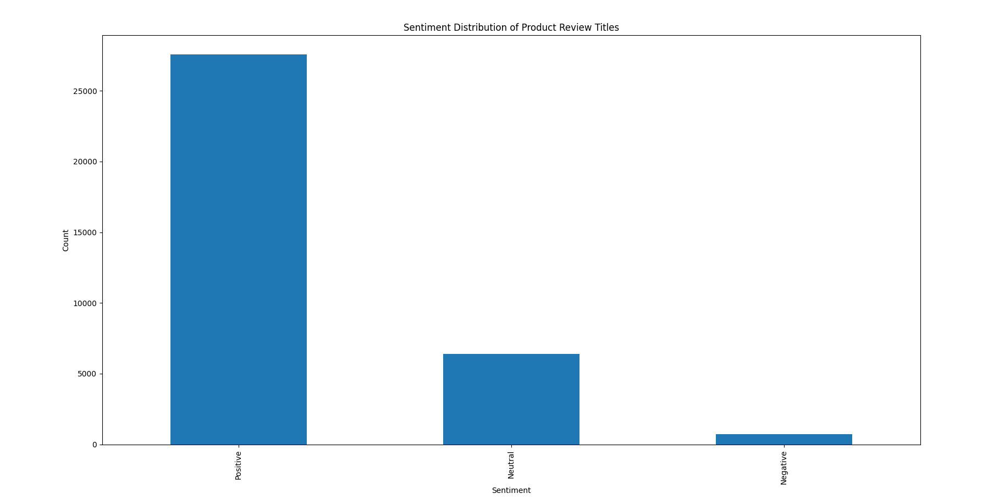

# Product Reviews Sentiment NLP
This repository contains a Python script for performing sentiment analysis on a dataset of Amazon product reviews. The analysis uses the spaCy library and TextBlob for natural language processing and sentiment analysis.

1. Importing Libraries:
Import necessary libraries including pandas, spacy, spacytextblob, and nltk.

2. Downloading NLTK Data:
 We download the stopwords dataset from NLTK.

3. Loading spaCy Model: 
Load the en_core_web_sm spaCy model and add the spacytextblob component to perform sentiment analysis.

4. Loading the Dataset: 
Load the dataset from a CSV file named amazon_product_reviews.csv.

5. Data Preprocessing: 
Select the review.text column, drop missing values, and preprocess the text by removing stopwords and performing basic text cleaning.

6. Sentiment Analysis Function: 
Define a function analyze_sentiment that uses the spacytextblob component to determine the sentiment of a review based on its polarity score and sentiment attribute.

7. Testing the Model:
 Test the sentiment analysis function on a few sample reviews and print the results, including the sentiment, polarity, and sentiment score.

8. Generating a Report: 
A brief report summarizing the dataset, preprocessing steps, evaluation of results, and insights is generated and saved as a text file.

9. Visualization: 
Optionally, we plot the distribution of sentiments in the product reviews.

10. Notes
Ensure that the amazon_product_reviews.csv file is in the same directory as the script or provide the correct path to the file.

The report is saved as a text file (sentiment_analysis_report.txt). If you prefer a PDF file, you can use libraries like fpdf or reportlab to generate a PDF.
The script includes comments that clarify the rationale behind each line of code.

## Table of Contents

- [Product Reviews Sentiment NLP](#product-reviews-sentiment-nlp)
  - [Table of Contents](#table-of-contents)
- [Introduction](#introduction)
- [Dataset](#dataset)
- [Requirements](#requirements)
- [python sentiment\_analysis.py](#python-sentiment_analysispy)
- [Preprocessing Steps](#preprocessing-steps)
- [Sentiment Analysis](#sentiment-analysis)
- [Similarity Analysis](#similarity-analysis)
- [Results](#results)
- [Contributing](#contributing)
- [Credits](#credits)
- [License](#license)

# Introduction
This project aims to analyze the sentiment of product reviews from Amazon. By utilizing natural language processing (NLP) techniques, the script processes and classifies the sentiment of reviews as positive, negative, or neutral.

# Dataset
The dataset used for this analysis is the Consumer Reviews of Amazon Products. The primary column of interest is 'review.text', which contains the text of the product reviews. Make sure to save the dataset as amazon_product_reviews.csv.

# Requirements
Python 3.6 or higher
Pandas
spaCy
spacytextblob
TextBlob
Installation
Clone the repository:

bash

git clone https://github.com/Mikemupararano/product-reviews-sentiment-nlp.git
Navigate to the project directory:

bash

cd product-reviews-sentiment-nlp
Install the required libraries:

bash

pip install -r requirements.txt
If requirements.txt is not provided, manually install the dependencies:

bash

pip install pandas spacy spacytextblob textblob
python -m textblob.download_corpora
Usage
Ensure the dataset amazon_product_reviews.csv is in the project directory.
Run the script:

bash

# python sentiment_analysis.py
The script will preprocess the reviews, perform sentiment analysis, and print the results of sample reviews and their sentiments. Additionally, it will save the sentiment results and review similarity scores to respective text files for further inspection.

# Preprocessing Steps
Loading Data: The dataset is loaded using Pandas, focusing on the review.text column.
Cleaning Data: Missing values in the review.text column are removed.
Text Cleaning: Reviews are processed to remove stopwords and non-alphabetical characters. The text is converted to lowercase and stripped of leading/trailing whitespace.

# Sentiment Analysis
The sentiment analysis is performed using the TextBlob library integrated with spaCy. The polarity score determines whether the sentiment is positive, negative, or neutral.

# Similarity Analysis
The script also includes functionality to compare the similarity of two reviews using the spaCy similarity function, providing insights into how closely related two reviews are.

# Results
Sample sentiment results are saved in sample_sentiment_results.txt.
Review similarity results are saved in review_similarity_results.txt.

Report
The detailed report of the sentiment analysis can be found in sentiment_analysis_report.pdf, which includes an image that was generated as follows:

# Contributing

Contributions are welcome! Please feel free to submit a Pull Request or open an issue.

The work is available on my Github repository at: https://github.com/Mikemupararano/product-reviews-sentiment-nlp.

# Credits
I have used resources from this Github to complete this task:
https://github.com/PacktPublishing/Python-Data-Analysis-Third-Edition/tree/master/Chapter12
# License
This project is licensed under the MIT License. See the LICENSE file for details.
